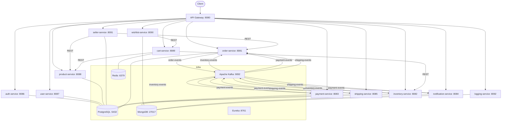
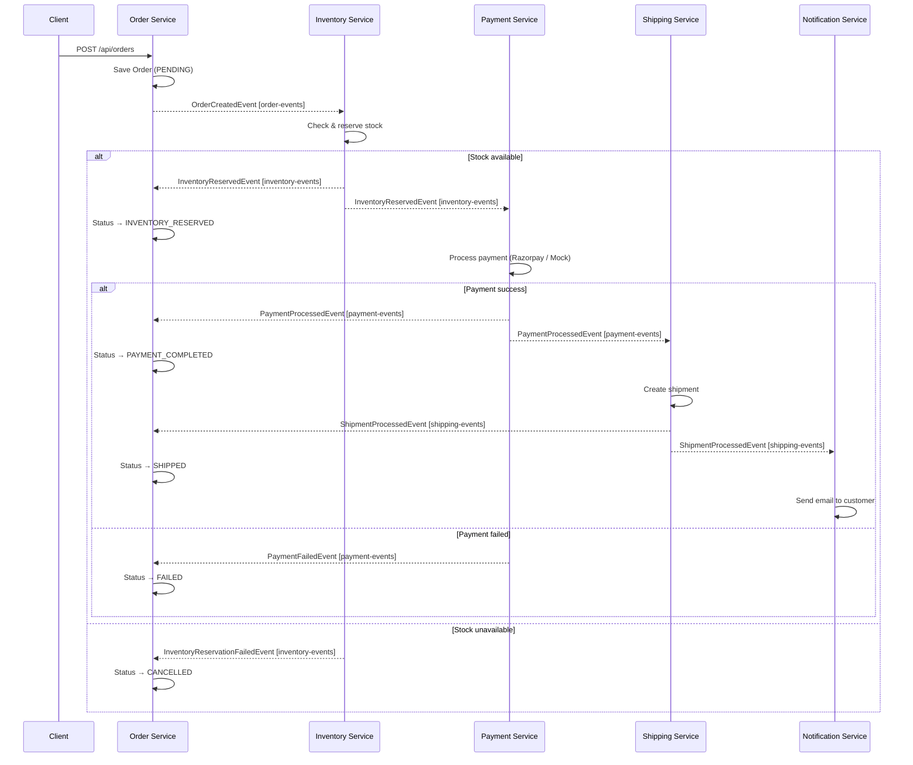

# E-Commerce Microservices Platform

A production-grade, event-driven e-commerce backend built with Spring Boot microservices. Services communicate asynchronously via Apache Kafka (saga pattern) and synchronously via REST through a central API Gateway with JWT authentication.

    

---

## Table of Contents

- [Architecture](#architecture)
- [Order Saga Flow](#order-saga-flow)
- [Quick Start](#quick-start)
- [Service Port Reference](#service-port-reference)
- [Services](#services)
  - [service-registry](#1-service-registry)
  - [api-gateway](#2-api-gateway)
  - [common-library](#3-common-library)
  - [auth-service](#4-auth-service)
  - [user-service](#5-user-service)
  - [product-service](#6-product-service)
  - [seller-service](#7-seller-service)
  - [cart-service](#8-cart-service)
  - [wishlist-service](#9-wishlist-service)
  - [order-service](#10-order-service)
  - [inventory-service](#11-inventory-service)
  - [payment-service](#12-payment-service)
  - [shipping-service](#13-shipping-service)
  - [notification-service](#14-notification-service)
  - [logging-service](#15-logging-service)
- [Kafka Topics](#kafka-topics)
- [Kubernetes](#kubernetes)

---

## Architecture



---

## Order Saga Flow

The core checkout flow is orchestrated via Kafka events (choreography-based saga).



---

## Quick Start

### Prerequisites

- Java 21
- Docker Desktop
- Maven 3.9+

### 1. Configure Environment

Create a `.env` file in the project root:

```env
# Database
DB_HOST=localhost
DB_PORT=5432
DB_USER=postgres
DB_PASSWORD=postgres123

# JWT (HMAC-SHA256 hex-encoded secret)
JWT_SECRET=your_jwt_secret_here

# Google OAuth2
GOOGLE_CLIENT_ID=your_google_client_id
GOOGLE_CLIENT_SECRET=your_google_client_secret

# Razorpay (payment gateway)
RAZORPAY_KEY_ID=your_razorpay_key_id
RAZORPAY_KEY_SECRET=your_razorpay_key_secret

# Email - auth-service uses AWS SES
MAIL_USERNAME=your_ses_smtp_username
MAIL_PASSWORD=your_ses_smtp_password

# Email - notification-service uses Resend
RESEND_API_KEY=your_resend_api_key
```

### 2. Start Infrastructure

```bash
docker-compose up -d
```

This starts:
- **Kafka** (KRaft mode, no ZooKeeper) on port `9092`
- **PostgreSQL** on port `5432` — auto-creates 7 databases: `auth_db`, `user_db`, `product_db`, `seller_db`, `order_db`, `payment_db`, `shipping_db`
- **MongoDB** on port `27017`
- **Redis** on port `6379`
- **Kafka UI** on port `8071` → http://localhost:8071

### 3. Build All Modules

```bash
./mvnw clean install -DskipTests
```

### 4. Start Services

Start in this order (each is a separate Spring Boot app):

```
1. service-registry     (Eureka must be up first)
2. api-gateway
3. auth-service
4. All remaining services (any order)
```

> **Kafka issues?** Run `FIX-KAFKA.ps1` (Windows PowerShell) or `FIX-KAFKA.bat` to reset the Kafka container.

---

## Service Port Reference

| Service | Port | Database |
|---|---|---|
| service-registry | 8761 | — |
| api-gateway | 8080 | — |
| auth-service | 8086 | PostgreSQL `auth_db` |
| user-service | 8087 | PostgreSQL `user_db` |
| product-service | 8088 | PostgreSQL `product_db` |
| seller-service | 8091 | PostgreSQL `seller_db` |
| cart-service | 8089 | Redis |
| wishlist-service | 8090 | MongoDB `wishlist_db` |
| order-service | 8081 | PostgreSQL `order_db` |
| inventory-service | 8082 | MongoDB `inventory` |
| payment-service | 8083 | PostgreSQL `payment_db` |
| shipping-service | 8085 | PostgreSQL `shipping_db` |
| notification-service | 8084 | MongoDB `notification_db` |
| logging-service | 8092 | MongoDB `logging_db` |
| Kafka UI | 8071 | — |

All services register with Eureka and are accessible through the API Gateway at `http://localhost:8080`.

---

## Services

---

### 1. Service Registry

**Port:** `8761` | Eureka Server

Central service discovery. Every microservice registers here on startup. The API Gateway uses it for load-balanced routing (`lb://service-name`).

- Dashboard: http://localhost:8761
- No REST API — infrastructure only.

---

### 2. API Gateway

**Port:** `8080` | Spring Cloud Gateway

Single entry point for all client requests. Validates JWT tokens and injects user identity headers (`X-User-Id`, `X-User-Email`, `X-User-Role`) into downstream requests.

**JWT Validation:**
- Algorithm: HMAC-SHA256
- Token parsed from `Authorization: Bearer <token>`
- On success: injects `X-User-Id`, `X-User-Email`, `X-User-Role` headers
- On failure: returns `401 Unauthorized`

**Route Table:**

| Path Pattern | Target Service | JWT Required |
|---|---|---|
| `/api/auth/**` | auth-service | No |
| `/api/orders/**` | order-service | Yes |
| `/api/inventory/**` | inventory-service | Yes |
| `/api/payments/**` | payment-service | Yes |
| `/api/shipping/**` | shipping-service | Yes |
| `/api/notifications/**` | notification-service | Yes |
| `/api/users/**` | user-service | Yes |
| `/api/products/**` | product-service | Yes |
| `/api/cart/**` | cart-service | Yes |
| `/api/wishlist/**` | wishlist-service | Yes |
| `/api/seller/**` | seller-service | Yes |
| `/api/admin/sellers/**` | seller-service | Yes |
| `/api/logs/**` | logging-service | Yes |

---

### 3. Common Library

**Type:** Shared Maven module (no server)

Contains all shared event classes and DTOs used across services. Every service that participates in the Kafka saga imports this library.

**Base Event fields** (all events extend `BaseEvent`):

| Field | Type | Description |
|---|---|---|
| eventId | UUID | Unique event identifier |
| correlationId | UUID | Links all events in one saga transaction |
| timestamp | Instant | When the event was created |

**Kafka Event Classes:**

| Class | Topic | Key Fields |
|---|---|---|
| `OrderCreatedEvent` | `order-events` | orderId, customerId, customerEmail, items, totalAmount |
| `InventoryReservedEvent` | `inventory-events` | orderId, customerId, customerEmail, totalAmount |
| `InventoryReservationFailedEvent` | `inventory-events` | orderId, reason |
| `PaymentProcessedEvent` | `payment-events` | orderId, paymentId, customerId, customerEmail |
| `PaymentFailedEvent` | `payment-events` | orderId, customerId, customerEmail, reason |
| `ShipmentProcessedEvent` | `shipping-events` | orderId, shipmentId, customerId, customerEmail, trackingNumber |
| `ShipmentFailedEvent` | `shipping-events` | orderId, reason |

**`OrderItemDto` fields:** `productId (UUID)`, `quantity (Integer)`, `price (BigDecimal)`

---

### 4. Auth Service

**Port:** `8086` | **Database:** PostgreSQL `auth_db`

Handles user registration, email verification (OTP), login, JWT issuance, refresh token rotation, password reset, and Google OAuth2 login.

- JWT access token: **15 minutes**
- Refresh token: **7 days** (rotated on each use)
- OTP expiry: **15 minutes** (6-digit, sent via AWS SES)
- Email provider: AWS SES (`email-smtp.eu-north-1.amazonaws.com`)

**API Endpoints:**

| Method | Path | Auth | Description |
|---|---|---|---|
| POST | `/api/auth/register` | Public | Register with name/email/password — sends OTP |
| POST | `/api/auth/verify-email` | Public | Verify email with OTP |
| POST | `/api/auth/resend-verification` | Public | Resend verification OTP |
| POST | `/api/auth/login` | Public | Login — returns accessToken + refreshToken |
| POST | `/api/auth/refresh` | Public | Exchange refresh token for new tokens |
| POST | `/api/auth/logout` | Public | Revoke refresh token |
| POST | `/api/auth/forgot-password` | Public | Send password reset OTP |
| POST | `/api/auth/reset-password` | Public | Reset password with OTP |
| GET | `/api/auth/me` | JWT | Get current user info |
| GET | `/api/auth/oauth2/authorize/google` | Public | Start Google OAuth2 login flow |

**Login Response:**
```json
{
  "accessToken": "eyJ...",
  "refreshToken": "uuid-token",
  "tokenType": "Bearer",
  "expiresIn": 900,
  "userId": "uuid",
  "name": "John Doe",
  "email": "john@example.com",
  "role": "ROLE_USER"
}
```

**Database Schema:**

`users` table:
| Column | Type | Notes |
|---|---|---|
| id | UUID PK | auto-generated |
| name | VARCHAR NOT NULL | |
| email | VARCHAR UNIQUE NOT NULL | |
| password_hash | VARCHAR | null for OAuth2 users |
| provider | ENUM (LOCAL, GOOGLE) | |
| provider_id | VARCHAR | Google sub claim |
| role | ENUM (ROLE_USER, ROLE_SELLER, ROLE_ADMIN) | |
| email_verified | BOOLEAN | |
| otp | VARCHAR | 6-digit, nulled after use |
| otp_expires_at | TIMESTAMP | 15-min window |
| created_at / updated_at | TIMESTAMP | |

`refresh_tokens` table:
| Column | Type | Notes |
|---|---|---|
| id | UUID PK | |
| token | VARCHAR UNIQUE | |
| user_id | UUID FK → users | |
| expires_at | TIMESTAMP | |
| revoked | BOOLEAN | |
| created_at | TIMESTAMP | |

---

### 5. User Service

**Port:** `8087` | **Database:** PostgreSQL `user_db`

Stores user profile and shipping address data. Auth is handled by auth-service — this service uses the `X-User-Id` header injected by the gateway to identify the user (same UUID as in auth-service).

**API Endpoints:**

| Method | Path | Description |
|---|---|---|
| POST | `/api/users/profile` | Create profile after registration |
| GET | `/api/users/profile` | Get my profile |
| PUT | `/api/users/profile` | Update name / phone |
| DELETE | `/api/users/profile` | Deactivate account |
| PATCH | `/api/users/profile/preferences` | Update language, currency, notifications |
| GET | `/api/users/addresses` | List all addresses |
| POST | `/api/users/addresses` | Add new address |
| PUT | `/api/users/addresses/{addressId}` | Update address |
| DELETE | `/api/users/addresses/{addressId}` | Delete address |
| PATCH | `/api/users/addresses/{addressId}/default` | Set default shipping address |

**Database Schema:**

`user_profiles` table:
| Column | Type | Notes |
|---|---|---|
| id | UUID PK | same UUID as auth-service |
| full_name | VARCHAR NOT NULL | |
| email | VARCHAR UNIQUE NOT NULL | |
| phone_number | VARCHAR | |
| account_status | ENUM (ACTIVE, SUSPENDED, DEACTIVATED) | |
| preferences_language | VARCHAR | embedded |
| preferences_currency | VARCHAR | embedded |
| preferences_email_notifications | BOOLEAN | embedded |
| created_at / updated_at | TIMESTAMP | |

`addresses` table:
| Column | Type | Notes |
|---|---|---|
| id | UUID PK | |
| user_profile_id | UUID FK | |
| label | VARCHAR | e.g. "Home", "Office" |
| recipient_name | VARCHAR | |
| phone_number | VARCHAR | |
| address_line1 / address_line2 | VARCHAR | |
| city / state / postal_code / country | VARCHAR | |
| default_address | BOOLEAN | |
| created_at / updated_at | TIMESTAMP | |

---

### 6. Product Service

**Port:** `8088` | **Database:** PostgreSQL `product_db`

Manages the product catalog. Sellers create and manage their own products. Supports full-text search, category filtering, price range filtering, pagination, and sorting.

**API Endpoints:**

| Method | Path | Description |
|---|---|---|
| POST | `/api/products` | Create a product (seller JWT required) |
| POST | `/api/products/bulk` | Create multiple products at once |
| GET | `/api/products/{id}` | Get product by ID |
| GET | `/api/products/sku/{sku}` | Get product by SKU |
| PUT | `/api/products/{id}` | Update product |
| PATCH | `/api/products/{id}/status` | Update status (ACTIVE / INACTIVE / PENDING) |
| DELETE | `/api/products/{id}` | Delete product |
| GET | `/api/products` | Search & filter with pagination |
| GET | `/api/products/category/{categoryId}` | Products by category |
| GET | `/api/products/my-products` | Logged-in seller's products |
| GET | `/api/products/seller/{sellerId}` | Products by seller |

**Search Query Params** (`GET /api/products`):
`keyword`, `categoryId`, `status`, `minPrice`, `maxPrice`, `brand`, `page`, `size`, `sortBy`, `sortDir`

**Database Schema:**

`categories` table:
| Column | Type | Notes |
|---|---|---|
| id | UUID PK | |
| name | VARCHAR UNIQUE NOT NULL | |
| description | VARCHAR | |
| parent_id | UUID FK (self) | nullable — for nested categories |
| created_at / updated_at | TIMESTAMP | |

`products` table:
| Column | Type | Notes |
|---|---|---|
| id | UUID PK | |
| name | VARCHAR NOT NULL | |
| description | VARCHAR(2000) | |
| sku | VARCHAR UNIQUE NOT NULL | |
| price | DECIMAL(12,2) NOT NULL | |
| original_price | DECIMAL(12,2) | compare-at / strike-through price |
| category_id | UUID FK → categories | |
| seller_id | UUID NOT NULL | auth-service user UUID |
| status | ENUM (ACTIVE, INACTIVE, PENDING) | |
| image_url | VARCHAR | primary image |
| brand | VARCHAR | |
| weight_grams | INTEGER | used for shipping cost calc |
| average_rating | DECIMAL(3,2) | 0.0 – 5.0 |
| rating_count | INTEGER | |
| created_at / updated_at | TIMESTAMP | |

`product_images` table:
| Column | Type |
|---|---|
| product_id | UUID FK |
| image_url | VARCHAR |

---

### 7. Seller Service

**Port:** `8091` | **Database:** PostgreSQL `seller_db`

Manages seller/merchant profiles and their verification lifecycle. Delegates product and order lookups to product-service and order-service via REST.

**API Endpoints:**

| Method | Path | Description |
|---|---|---|
| POST | `/api/seller/register` | Register as a seller |
| GET | `/api/seller/profile` | Get own seller profile |
| PUT | `/api/seller/profile` | Update store name / phone / address |
| GET | `/api/seller/products` | Seller's product listings (via product-service) |
| GET | `/api/seller/orders` | Orders containing seller's products (via order-service) |
| GET | `/api/seller/analytics` | Sales analytics: total orders, revenue, avg order value |
| GET/POST | `/api/admin/sellers/**` | Admin verification endpoints |

**Database Schema:**

`seller_profiles` table:
| Column | Type | Notes |
|---|---|---|
| seller_id | UUID PK | |
| user_id | UUID UNIQUE NOT NULL | auth-service UUID |
| store_name | VARCHAR NOT NULL | |
| email | VARCHAR UNIQUE NOT NULL | |
| phone | VARCHAR | |
| business_address | VARCHAR | |
| business_registration_number | VARCHAR | |
| verification_status | ENUM (PENDING, VERIFIED, REJECTED, SUSPENDED) | |
| rating | DECIMAL(3,2) | |
| rating_count | INTEGER | |
| verification_notes | VARCHAR(1000) | admin review notes |
| created_at / updated_at | TIMESTAMP | |

---

### 8. Cart Service

**Port:** `8089` | **Database:** Redis (TTL: 7 days)

Session-based shopping cart stored in Redis. Validates product existence against product-service and checks stock availability against inventory-service before adding items.

**API Endpoints:**

| Method | Path | Description |
|---|---|---|
| GET | `/api/cart` | Get current cart (creates empty if none exists) |
| POST | `/api/cart/items` | Add item (validates stock first) |
| PUT | `/api/cart/items/{productId}` | Update item quantity |
| DELETE | `/api/cart/items/{productId}` | Remove item |
| DELETE | `/api/cart` | Clear entire cart |

**Redis Data Model:**

Key: `cart:{userId}`  
Value: serialized JSON of `Cart` object

```
Cart {
  cartId, userId,
  items: [{ productId, productName, quantity, unitPrice, totalPrice, imageUrl, sku }],
  grandTotal,
  createdAt, updatedAt
}
```

---

### 9. Wishlist Service

**Port:** `8090` | **Database:** MongoDB `wishlist_db`

Lets users save products for later. Enforces no-duplicate constraint via a compound unique index on `{userId, productId}`. Can move items directly to cart.

**API Endpoints:**

| Method | Path | Description |
|---|---|---|
| POST | `/api/wishlist/add` | Add product to wishlist (409 on duplicate) |
| DELETE | `/api/wishlist/remove/{productId}` | Remove from wishlist |
| GET | `/api/wishlist/{userId}` | Get user's full wishlist |
| POST | `/api/wishlist/move-to-cart/{productId}` | Move to cart and remove from wishlist |

**MongoDB Collection:** `wishlist_items`

| Field | Type | Notes |
|---|---|---|
| _id | UUID | |
| userId | UUID | indexed |
| productId | UUID | |
| productName | String | denormalized snapshot |
| productImageUrl | String | |
| productSku | String | |
| addedAt | Instant | |

Compound unique index: `{ userId: 1, productId: 1 }`

---

### 10. Order Service

**Port:** `8081` | **Database:** PostgreSQL `order_db`

Creates orders and drives the entire saga. On order creation it saves the order, publishes `OrderCreatedEvent` to Kafka, and then listens for outcome events from inventory, payment, and shipping services to advance the order status.

**API Endpoints:**

| Method | Path | Description |
|---|---|---|
| POST | `/api/orders` | Create order — triggers the full saga |
| GET | `/api/orders/{orderId}` | Get order by ID |
| GET | `/api/orders` | Get all orders |
| GET | `/api/orders/customer/{customerId}` | Orders by customer |

**Kafka:** Publishes → `order-events` | Consumes → `inventory-events`, `payment-events`, `shipping-events`

**Order Status Lifecycle:**

```
PENDING → INVENTORY_CHECKING → INVENTORY_RESERVED → PAYMENT_PROCESSING
→ PAYMENT_COMPLETED → SHIPPING_PROCESSING → SHIPPED → COMPLETED
                                                     ↘ CANCELLED (inventory fail)
                                                     ↘ FAILED (payment/shipping fail)
```

**Database Schema:**

`orders` table:
| Column | Type | Notes |
|---|---|---|
| id | UUID PK | |
| customer_id | UUID NOT NULL | |
| customer_email | VARCHAR | |
| total_amount | DECIMAL NOT NULL | |
| status | ENUM | see lifecycle above |
| created_at / created_by | TIMESTAMP / VARCHAR | |
| last_modified_at / last_modified_by | TIMESTAMP / VARCHAR | |

`order_items` table:
| Column | Type |
|---|---|
| id | UUID PK |
| order_id | UUID FK |
| product_id | UUID |
| product_name | VARCHAR |
| quantity | INTEGER |
| price | DECIMAL |

---

### 11. Inventory Service

**Port:** `8082` | **Database:** MongoDB `inventory`

Manages product stock levels. Listens for `OrderCreatedEvent`, validates and reserves stock, then publishes success or failure events. Publishes low-stock alerts to `inventory-alerts` topic when available quantity drops below threshold.

**API Endpoints:**

| Method | Path | Description |
|---|---|---|
| POST | `/api/inventory` | Create inventory record for a product |
| GET | `/api/inventory/{id}` | Get by ID |
| GET | `/api/inventory/product/{productId}` | Get by product UUID |
| GET | `/api/inventory` | List all records |
| PUT | `/api/inventory/{id}` | Update record |
| POST | `/api/inventory/{id}/restock` | Add units to available stock |
| DELETE | `/api/inventory/{id}` | Delete record |
| GET | `/api/inventory/check?productId=&quantity=` | Check if stock is sufficient |
| GET | `/api/inventory/low-stock` | List all LOW_STOCK items |

**Kafka:** Consumes → `order-events` | Publishes → `inventory-events`, `inventory-alerts`

**MongoDB Collection:** `inventory`

| Field | Type | Notes |
|---|---|---|
| _id | UUID | |
| productId | UUID | references product-service |
| name / description | String | |
| availableQuantity | Integer | units available to buy |
| reservedQuantity | Integer | units held for pending orders |
| warehouseLocation | String | e.g. "WH-A1", "SHELF-B3" |
| status | ENUM (IN_STOCK, LOW_STOCK, OUT_OF_STOCK) | |
| lowStockThreshold | Integer | default 10 — triggers alert |
| createdAt / updatedAt | LocalDateTime | |

**MongoDB Collection:** `reservations`

| Field | Type | Notes |
|---|---|---|
| _id | UUID | |
| orderId | UUID | |
| correlationId | UUID | saga tracking |
| items | `[{ productId, quantity }]` | |
| status | ENUM (PENDING, CONFIRMED, CANCELLED) | |
| createdAt / updatedAt | LocalDateTime | |

---

### 12. Payment Service

**Port:** `8083` | **Database:** PostgreSQL `payment_db`

Processes payments via Razorpay, Stripe, or a Mock adapter (dev/testing). Supports two flows: automatic saga-driven processing and manual frontend-initiated flow. Also handles refunds.

**Payment Flows:**

1. **Saga (auto):** Triggered by `InventoryReservedEvent` → uses MOCK adapter → publishes result
2. **Manual:** `POST /initiate` → frontend redirects to gateway → `POST /verify` → publishes result
3. **Refund:** Partial or full refund via gateway

**API Endpoints:**

| Method | Path | Description |
|---|---|---|
| POST | `/api/payments/initiate` | Create gateway order (Razorpay/Stripe/Mock) |
| POST | `/api/payments/verify` | Verify signature & capture payment |
| POST | `/api/payments/refund` | Refund payment (partial or full) |
| GET | `/api/payments/{paymentId}` | Get payment by ID |
| GET | `/api/payments/order/{orderId}` | Get payment by order |
| GET | `/api/payments/customer/{customerId}` | All payments by customer |

**Kafka:** Consumes → `inventory-events` | Publishes → `payment-events`

**Database Schema:**

`payments` table:
| Column | Type | Notes |
|---|---|---|
| id | UUID PK | |
| order_id | UUID NOT NULL | |
| customer_id | UUID NOT NULL | |
| correlation_id | UUID | saga tracking |
| customer_email | VARCHAR | |
| amount | DECIMAL(12,2) NOT NULL | |
| refunded_amount | DECIMAL(12,2) | null until refund |
| status | ENUM | see below |
| gateway | ENUM (RAZORPAY, STRIPE, MOCK) | |
| payment_method | VARCHAR | CARD/UPI/NET_BANKING/WALLET |
| gateway_payment_id | VARCHAR | used for refunds |
| gateway_order_id | VARCHAR | Razorpay order ID |
| gateway_signature | VARCHAR | HMAC-SHA256 verification |
| failure_reason | VARCHAR(500) | |
| transaction_id | VARCHAR | internal TXN-XXXXXXXXXXXX |
| payment_date / refund_date | TIMESTAMP | |
| created_at / updated_at | TIMESTAMP | |

**PaymentStatus:** `PENDING → AUTHORIZED → COMPLETED / FAILED / REFUND_PENDING → REFUNDED / PARTIALLY_REFUNDED`

---

### 13. Shipping Service

**Port:** `8085` | **Database:** PostgreSQL `shipping_db`

Creates shipments when payment is confirmed. Assigns a tracking number and carrier, then publishes `ShipmentProcessedEvent` to trigger order and notification updates.

**API Endpoints:**

| Method | Path | Description |
|---|---|---|
| GET | `/api/shipping/{shipmentId}` | Get shipment by ID |
| GET | `/api/shipping/order/{orderId}` | Get shipment by order ID |

**Kafka:** Consumes → `payment-events` | Publishes → `shipping-events`

**Database Schema:**

`shipments` table:
| Column | Type | Notes |
|---|---|---|
| id | UUID PK | |
| order_id | UUID | |
| customer_id | UUID | |
| correlation_id | UUID | saga tracking |
| status | ENUM (PENDING, PROCESSING, SHIPPED, DELIVERED, CANCELLED) | |
| tracking_number | VARCHAR | |
| carrier_name | VARCHAR | |
| shipped_date | TIMESTAMP | |
| estimated_delivery_date | TIMESTAMP | |
| shipping_address | VARCHAR | |
| recipient_name / recipient_phone | VARCHAR | |
| created_at / last_modified_at | TIMESTAMP | |

---

### 14. Notification Service

**Port:** `8084` | **Database:** MongoDB `notification_db`

Sends transactional emails to customers and stores in-app notifications. Listens to business events from Kafka and sends emails via Resend SMTP. Failed emails are retried up to 3 times via a scheduled job.

**API Endpoints:**

| Method | Path | Description |
|---|---|---|
| GET | `/api/notifications` | Get all my notifications |
| GET | `/api/notifications/unread` | Get unread notifications |
| GET | `/api/notifications/unread/count` | Unread count (for badge) |
| GET | `/api/notifications/order/{orderId}` | Notifications for a specific order |
| PATCH | `/api/notifications/{id}/read` | Mark one as read |
| PATCH | `/api/notifications/read-all` | Mark all as read |

**Kafka:** Consumes → `order-events`, `payment-events`, `shipping-events`

**Email provider:** Resend (`smtp.resend.com:587`)

**MongoDB Collection:** `notifications`

| Field | Type | Notes |
|---|---|---|
| _id | UUID | |
| recipientId | UUID | indexed |
| orderId | UUID | indexed |
| recipientEmail | String | |
| subject / message | String | |
| type | ENUM | ORDER_PLACED, PAYMENT_SUCCESS, PAYMENT_FAILED, ORDER_SHIPPED, ORDER_DELIVERED, OTP_VERIFICATION, PASSWORD_RESET |
| status | ENUM (PENDING, SENT, FAILED, RETRY_PENDING) | |
| retryCount | Integer | max 3 |
| read | Boolean | |
| createdAt / sentAt / updatedAt | LocalDateTime | |

---

### 15. Logging Service

**Port:** `8092` | **Database:** MongoDB `logging_db`

Centralized observability service. Intercepts all Kafka business events and converts them into structured log entries. Services can also publish explicit log entries to the `service-logs` topic. Logs are auto-deleted after 30 days via a MongoDB TTL index.

**API Endpoints:**

| Method | Path | Description |
|---|---|---|
| GET | `/api/logs` | Search logs (serviceName, level, keyword, traceId, from, to, page, size) |
| GET | `/api/logs/{id}` | Get single log entry |
| GET | `/api/logs/trace/{traceId}` | All logs for one saga (cross-service trace) |
| GET | `/api/logs/stats?windowMinutes=60` | Aggregate stats per service/level |
| GET | `/api/logs/errors/recent?minutes=10` | Recent errors for monitoring dashboard |

**Kafka:** Consumes → `service-logs`, `order-events`, `payment-events`, `inventory-events`, `shipping-events`

**MongoDB Collection:** `log_entries`

| Field | Type | Notes |
|---|---|---|
| _id | UUID | |
| serviceName | String | indexed |
| level | ENUM (DEBUG, INFO, WARN, ERROR) | indexed |
| message | String | |
| traceId | String | correlationId — links events across services |
| exceptionClass / stackTrace | String | for ERROR entries |
| endpoint | String | e.g. "GET /api/orders/123" |
| httpStatus | Integer | |
| durationMs | Long | |
| source | ENUM (SERVICE_LOG, KAFKA_EVENT, API_ACCESS) | |
| metadata | Map<String,Object> | flexible extra context |
| expiresAt | Instant | TTL index — auto-deleted after 30 days |
| timestamp | Instant | indexed |

Compound indexes: `{ serviceName, level, timestamp }` and `{ traceId }`

---

## Kafka Topics

| Topic | Produced By | Consumed By | Events |
|---|---|---|---|
| `order-events` | order-service | inventory-service, logging-service | `OrderCreatedEvent` |
| `inventory-events` | inventory-service | order-service, payment-service, logging-service | `InventoryReservedEvent`, `InventoryReservationFailedEvent` |
| `inventory-alerts` | inventory-service | ops/monitoring | `LOW_STOCK_ALERT` (Map payload) |
| `payment-events` | payment-service | order-service, shipping-service, notification-service, logging-service | `PaymentProcessedEvent`, `PaymentFailedEvent` |
| `shipping-events` | shipping-service | order-service, notification-service, logging-service | `ShipmentProcessedEvent`, `ShipmentFailedEvent` |
| `service-logs` | any service | logging-service | Explicit log entries |
| `wishlist-events` | wishlist-service | (future use) | Wishlist activity events |

**Kafka config (docker-compose):**
- Mode: KRaft (no ZooKeeper)
- External port: `9092` (from host), internal: `29092` (between containers)
- Auto topic creation: enabled
- Kafka UI: http://localhost:8071

---

## Kubernetes

Kubernetes manifests are in the `/k8s` directory. Currently the **order-service** is the reference deployment — it demonstrates the pattern for containerizing any service.

**Files:**

`k8s/order-deployment.yaml`
```yaml
# Deploys order-service with SPRING_PROFILES_ACTIVE=k8s
# Uses order-service:latest image (local build)
# Container port: 8051 (k8s profile overrides default 8081)
```

`k8s/order-service.yaml`
```yaml
# NodePort Service exposing port 8051
```

**Running with Kubernetes:**

```bash
# Build the Docker image first
cd order-service
docker build -t order-service:latest .

# Apply manifests
kubectl apply -f k8s/order-deployment.yaml
kubectl apply -f k8s/order-service.yaml
```

**K8s profile differences** (`application-k8s.yml`):
- Port: `8051` (instead of `8081`)
- DB URL: `host.docker.internal:5432`
- Kafka: `host.docker.internal:9092`
- Eureka: `host.docker.internal:8761`

> To containerize other services, follow the same pattern: add a `Dockerfile`, create `application-k8s.yml`, and add `Deployment` + `Service` manifests to `/k8s`.

---

## Project Structure

```
ecommerce-microservices/
├── pom.xml                    # Parent POM — Java 21, Spring Boot 3.2.12
├── docker-compose.yml         # Kafka, PostgreSQL, MongoDB, Redis, Kafka UI
├── .env                       # Environment variables
├── scripts/
│   └── create-multiple-postgres-dbs.sh   # Auto-creates all 7 PostgreSQL databases
├── k8s/                       # Kubernetes manifests (order-service)
├── common-library/            # Shared Kafka events and DTOs
├── service-registry/          # Eureka server
├── api-gateway/               # Spring Cloud Gateway + JWT filter
├── auth-service/              # Authentication & JWT
├── user-service/              # User profiles & addresses
├── product-service/           # Product catalog & categories
├── seller-service/            # Merchant management
├── cart-service/              # Redis shopping cart
├── wishlist-service/          # MongoDB wishlists
├── order-service/             # Order management + saga orchestration
├── inventory-service/         # Stock management
├── payment-service/           # Razorpay / Stripe / Mock payments
├── shipping-service/          # Shipment tracking
├── notification-service/      # Email + in-app notifications
└── logging-service/           # Centralized log aggregation
```

---

## Tech Stack

| Layer | Technology |
|---|---|
| Language | Java 21 |
| Framework | Spring Boot 3.2.12, Spring Cloud 2023.0.2 |
| Service Discovery | Netflix Eureka |
| API Gateway | Spring Cloud Gateway |
| Messaging | Apache Kafka (KRaft mode, Confluent 7.5.0) |
| Relational DB | PostgreSQL (7 separate databases) |
| Document DB | MongoDB (4 databases) |
| Cache | Redis 7 |
| Auth | JWT (JJWT), Spring Security, Google OAuth2 |
| Payment | Razorpay, Stripe (stub), Mock |
| Email | AWS SES (auth), Resend (notifications) |
| Build | Maven (multi-module) |
| Containerization | Docker Compose, Kubernetes |
| Code generation | Lombok, MapStruct |
